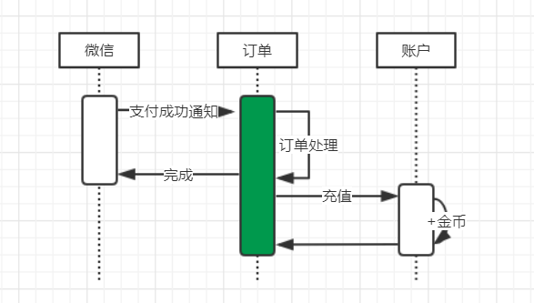
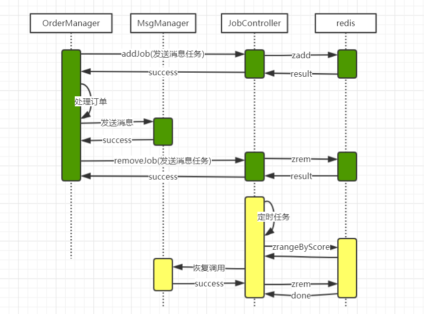
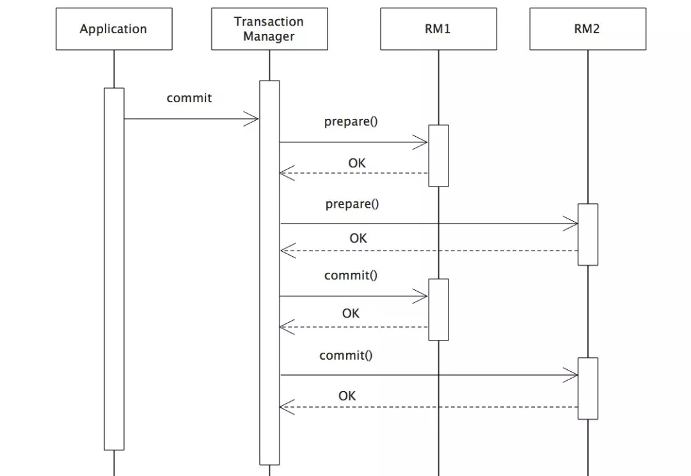
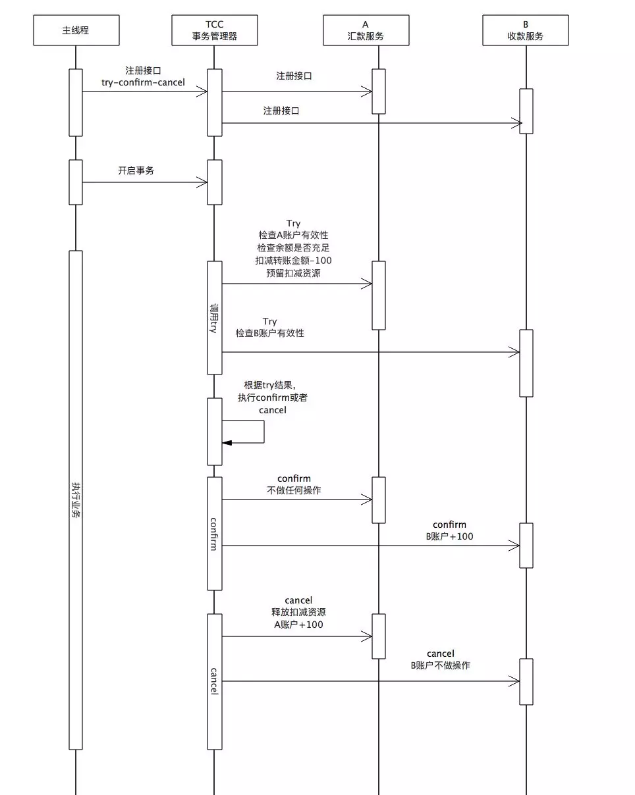
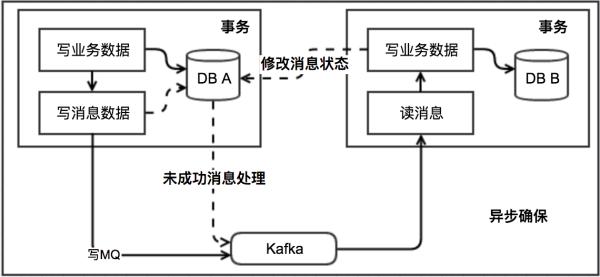

# 从一笔金币充值去思考分布式事务

## 大纲

1. 此次分享的缘由
2. 目前分布式事务问题是怎么解决的
3. 行业中有什么解决方案
4. 这些解决方案分别有什么优缺点
5. 别人是怎么做的
6. 我们可以怎么来做

## 此次分享的缘由

### 支付重构

考虑支付重构的时候，自然想到原本属于一个本地事务中的处理，现在要跨应用了要怎么处理。拿充值订单举个栗子吧，假设：原本订单模块和账户模块是放在一起的，现在需要做服务拆分，拆分成订单服务，账户服务。原本收到充值回调后，可以将修改订单状态和增加金币放在一个mysql事务中完成的，但是呢，因为服务拆分了，就面临着需要协调2个服务才能完成这个事务




所以就带出来，我们今天要分享和讨论的话题是：**怎么解决分布式场景下数据一致性问题**，暂且用**分布式事务** 来定义吧。

同样的问题还存在于其他的场景：

送礼：

 	1. 调用支付服务：先扣送礼用户的金币，然后给主播加相应的荔枝
 	2. 确认第一步成功后，播放特效，发聊天室送礼评论等

充值成功消息：

1. 完成充值订单
2. 发送订单完成的kafka消息

在涉及支付交易等付费接口的时候，数据一致性的问题就显得尤为重要，**因为都是钱啊**


## 目前分布式事务是怎么解决的呢？

问题肯定不是新问题，也就是目前已经有相应的解决方案了，那就看一下现在是怎么来解决这类问题的吧。

>  以**购买基础商品成功**后**发送支付订单完成消息**为例：
>
> 假设支付下单购买基础商品，此刻已经收到支付回调，订单已经处理成功了，这个时候kafka服务故障，消息发送失败；而这个时候处理订单的事务已经提交了，**怎么保证订单完成的消息一定能发出去呢？**



解读一下这个流程：

**绿色部分**，表示流程正常运行的交互过程：

1. 先往JobController中提交一个job（用于故障恢复）
2. 提交成功后，开始处理订单逻辑
3. 处理完订单逻辑之后，开始发送kafka消息
4. 消息也发送成功后，删除第一步提交的job

**黄色部分**，表示流程出现了异常，数据可能存在不一致现象。这个时候就需要进行流程恢复

1. JobController任务控制器定时去redis查询延时任务列表（每个任务都有一个时间戳，按时间戳排序过滤）
2. 将任务进行恢复（调用job注册时定义的处理方法）
3. 任务执行成功，表示流程完成；否则下一个定时周期重试


问题：

1. 基于redis存储恢复任务，可能存在数据丢失风险
2. 架构体系中没有统一的分布式事务规范，可否将这层逻辑独立为分布式事务中间件
3. 缺少事务执行策略管理，如：控制最大重试次数等
4. 事务执行状态没有记录，追查需要去翻看日志


## 行业中有什么解决方案

>  说解决方案之前，我们先了解一下这些方案的理论依据，有助于帮助我们来理解和实践这些方案

### 理论依据（讨论的前提）

#### 本地事务、分布式事务
如果说**本地事务**是解决单个数据源上的数据操作的一致性问题的话，那么**分布式事务**则是为了解决跨越多个数据源上数据操作的一致性问题。

#### 强一致性、弱一致性、最终一致性

从客户端角度，多进程并发访问时，更新过的数据在不同进程如何获取的不同策略，决定了不同的一致性。对于关系型数据库，要求更新过的数据能被后续的访问都能看到，这是**强一致性**。如果能容忍后续的部分或者全部访问不到，则是**弱一致性**。如果经过一段时间后要求能访问到更新后的数据，则是**最终一致性**

从**服务端**角度，如何尽快将更新后的数据分布到整个系统，降低达到最终一致性的时间窗口，是提高系统的可用度和用户体验非常重要的方面。对于分布式数据系统：

- N — 数据复制的份数 
- W — 更新数据时需要保证写完成的节点数 
- R — 读取数据的时候需要读取的节点数 

如果W+R>N，写的节点和读的节点重叠，则是强一致性。例如对于典型的一主一备同步复制的关系型数据库，N=2,W=2,R=1，则不管读的是主库还是备库的数据，都是一致的。

如果W+R<=N，则是弱一致性。例如对于一主一备异步复制的关系型数据库，N=2,W=1,R=1，则如果读的是备库，就可能无法读取主库已经更新过的数据，所以是弱一致性。

#### CAP理论
分布式环境下（数据分布）要任何时刻保证数据一致性是不可能的，只能采取妥协的方案来保证数据最终一致性。这个也就是著名的CAP定理。


需要明确的一点是，对于一个分布式系统而言，分区容错性是一个最基本的要求。因为 既然是一个分布式系统，那么分布式系统中的组件必然需要被部署到不同的节点，否则也就无所谓分布式系统了，因此必然出现子网络。而对于分布式系统而言，网 络问题又是一个必定会出现的异常情况，因此分区容错性也就成为了一个分布式系统必然需要面对和解决的问题。因此系统架构师往往需要把精力花在如何根据业务 特点在C（一致性）和A（可用性）之间寻求平衡。


#### BASE 理论
BASE是Basically Available（基本可用）、Soft state（软状态）和Eventually consistent（最终一致性）三个短语的缩写。BASE理论是对CAP中一致性和可用性权衡的结果，其来源于对大规模互联网系统分布式实践的总结， 是基于CAP定理逐步演化而来的。BASE理论的核心思想是：即使无法做到强一致性，但每个应用都可以根据自身业务特点，采用适当的方式来使系统达到最终一致性。

BASE理论面向的是大型高可用可扩展的分布式系统，和传统的事物ACID特性是相反的，它完全不同于ACID的强一致性模型，而是**通过牺牲强一致性来获得可用性，并允许数据在一段时间内是不一致的，但最终达到一致状态**。但同时，在实际的分布式场景中，不同业务单元和组件对数据一致性的要求是不同的，因此在具体的分布式系统架构设计过程中，ACID特性和BASE理论往往又会结合在一起。

#### 柔性事务
不同于ACID的刚性事务，在分布式场景下基于BASE理论，就出现了柔性事务的概念。要想通过柔性事务来达到最终的一致性，就需要依赖于一些特性，这些特性在具体的方案中不一定都要满足，因为不同的方案要求不一样；但是都不满足的话，是不可能做柔性事务的。

##### 可见性(对外可查询)
在分布式事务执行过程中，如果某一个步骤执行出错，就需要明确的知道其他几个操作的处理情况，这就需要其他的服务都能够提供查询接口，保证可以通过查询来判断操作的处理情况。

为了保证操作的可查询，需要对于每一个服务的每一次调用都有一个全局唯一的标识，可以是业务单据号（如订单号）、也可以是系统分配的操作流水号（如支付记录流水号）。除此之外，操作的时间信息也要有完整的记录。

##### 幂等操作
幂等性，其实是一个数学概念。幂等函数，或幂等方法，是指可以使用相同参数重复执行，并能获得相同结果的函数。
> f(f(x)) = f(x)

在编程中一个幂等操作的特点是其任意多次执行所产生的影响均与一次执行的影响相同。也就是说，同一个方法，使用同样的参数，调用多次产生的业务结果与调用一次产生的业务结果相同。
这一个要求其实也比较好理解，因为要保证数据的最终一致性，很多解决防范都会有很多重试的操作，如果一个方法不保证幂等，那么将无法被重试。
幂等操作的实现方式有多种，如在系统中缓存所有的请求与处理结果、检测到重复操作后，直接返回上一次的处理结果等。

### 业界方案

#### 两阶段提交（2PC）

XA是X/Open CAE Specification (Distributed Transaction Processing)模型中定义的TM（Transaction Manager）与RM（Resource Manager）之间进行通信的接口。

在XA规范中，数据库充当RM角色，应用需要充当TM的角色，即生成全局的txId，调用XAResource接口，把多个本地事务协调为全局统一的分布式事务。



二阶段提交是XA的标准实现。它将分布式事务的提交拆分为2个阶段：prepare和commit/rollback。

2PC模型中，在prepare阶段需要等待所有参与子事务的反馈，因此可能造成数据库资源锁定时间过长，不适合并发高以及子事务生命周长较长的业务场景。两阶段提交这种解决方案属于牺牲了一部分可用性来换取的一致性。

#### saga
saga的提出，最早是为了解决可能会长时间运行的分布式事务（long-running process）的问题。所谓long-running的分布式事务，是指那些企业业务流程，需要跨应用、跨企业来完成某个事务，甚至在事务流程中还需要有手工操作的参与，这类事务的完成时间可能以分计，以小时计，甚至可能以天计。这类事务如果按照事务的ACID的要求去设计，势必造成系统的可用性大大的降低。试想一个由两台服务器一起参与的事务，服务器A发起事务，服务器B参与事务，B的事务需要人工参与，所以处理时间可能很长。如果按照ACID的原则，要保持事务的隔离性、一致性，服务器A中发起的事务中使用到的事务资源将会被锁定，不允许其他应用访问到事务过程中的中间结果，直到整个事务被提交或者回滚。这就造成事务A中的资源被长时间锁定，系统的可用性将不可接受。

而**saga，则是一种基于补偿的消息驱动的用于解决long-running process的一种解决方案。目标是为了在确保系统高可用的前提下尽量确保数据的一致性**。还是上面的例子，如果用saga来实现，那就是这样的流程：服务器A的事务先执行，如果执行顺利，那么事务A就先行提交；如果提交成功，那么就开始执行事务B，如果事务B也执行顺利，则事务B也提交，整个事务就算完成。但是如果事务B执行失败，那事务B本身需要回滚，这时因为事务A已经提交，所以需要执行一个补偿操作，将已经提交的事务A执行的操作作反操作，恢复到未执行前事务A的状态。**这样的基于消息驱动的实现思路，就是saga**。我们可以看出，saga是牺牲了数据的强一致性，仅仅实现了最终一致性，但是提高了系统整体的可用性。

#### 补偿事务（TCC）

TCC 其实就是采用的补偿机制，其核心思想是：针对每个操作，都要注册一个与其对应的确认和补偿（撤销）操作。TCC模型是把锁的粒度完全交给业务处理。它分为三个阶段：

1. Try 阶段主要是对业务系统做检测及资源预留
2. Confirm 阶段主要是对业务系统做确认提交，Try阶段执行成功并开始执行 Confirm阶段时，默认 Confirm阶段是不会出错的。即：只要Try成功，Confirm一定成功。
3. Cancel 阶段主要是在业务执行错误，需要回滚的状态下执行的业务取消，预留资源释放。

下面对TCC模式下，A账户往B账户汇款100元为例子，对业务的改造进行详细的分析：


汇款服务和收款服务分别需要实现，Try-Confirm-Cancel接口，并在业务初始化阶段将其注入到TCC事务管理器中。

```
[汇款服务]
Try：
    检查A账户有效性，即查看A账户的状态是否为“转帐中”或者“冻结”；
    检查A账户余额是否充足；
    从A账户中扣减100元，并将状态置为“转账中”；
    预留扣减资源，将从A往B账户转账100元这个事件存入消息或者日志中；
Confirm：
	不做任何操作；
Cancel：
    A账户增加100元；
	从日志或者消息中，释放扣减资源。

[收款服务]
Try：
	检查B账户账户是否有效；
Confirm：
    读取日志或者消息，B账户增加100元；
    从日志或者消息中，释放扣减资源；
Cancel：
	不做任何操作。
```

由此可以看出，TCC模型对业务的侵入强，改造的难度大。


#### 本地消息表（异步确保）
本地消息表这种实现方式应该是业界使用最多的，其核心思想是将分布式事务拆分成本地事务进行处理，这种思路是来源于ebay。我们可以从下面的流程图中看出其中的一些细节：



基本思路就是：

消息生产方，需要额外建一个消息表，并记录消息发送状态。消息表和业务数据要在一个事务里提交，也就是说他们要在一个数据库里面。然后消息会经过MQ发送到消息的消费方。如果消息发送失败，会进行重试发送。

消息消费方，需要处理这个消息，并完成自己的业务逻辑。此时如果本地事务处理成功，表明已经处理成功了，如果处理失败，那么就会重试执行。如果是业务上面的失败，可以给生产方发送一个业务补偿消息，通知生产方进行回滚等操作。

生产方和消费方定时扫描本地消息表，把还没处理完成的消息或者失败的消息再发送一遍。如果有靠谱的自动对账补账逻辑，这种方案还是非常实用的。

#### 事务消息

事务消息作为一种异步确保型事务， 将两个事务分支通过MQ进行异步解耦，事务消息的设计流程同样借鉴了两阶段提交理论，整体交互流程如下图所示：


1. 事务发起方首先发送prepare消息到MQ。
2. 在发送prepare消息成功后执行本地事务。
3. 根据本地事务执行结果返回commit或者是rollback。
4. 如果消息是rollback，MQ将删除该prepare消息不进行下发，如果是commit消息，MQ将会把这个消息发送给consumer端。
5. 如果执行本地事务过程中，执行端挂掉，或者超时，MQ将会不停的询问其同组的其它producer来获取状态。
6. Consumer端的消费成功机制有MQ保证。

有一些第三方的MQ是支持事务消息的，比如RocketMQ，但是市面上一些主流的MQ都是不支持事务消息的，比如 RabbitMQ 和 Kafka 都不支持。

#### 尽最大努力通知
最大努力通知方案主要也是借助MQ消息系统来进行事务控制，这一点与可靠消息最终一致方案一样。看来MQ中间件确实在一个分布式系统架构中，扮演者重要的角色。最大努力通知方案是比较简单的分布式事务方案，它本质上就是通过定期校对，实现数据一致性。

最大努力通知方案的实现

1. 业务活动的主动方，在完成业务处理之后，向业务活动的被动方发送消息，允许消息丢失。
2. 主动方可以设置时间阶梯型通知规则，在通知失败后按规则重复通知，直到通知N次后不再通知。
3. 主动方提供校对查询接口给被动方按需校对查询，用于恢复丢失的业务消息。
4. 业务活动的被动方如果正常接收了数据，就正常返回响应，并结束事务。
5. 如果被动方没有正常接收，根据定时策略，向业务活动主动方查询，恢复丢失的业务消息

最大努力通知方案的特点
        
1. 用到的服务模式：可查询操作、幂等操作。
2. 被动方的处理结果不影响主动方的处理结果；
3. 适用于对业务最终一致性的时间敏感度低的系统；
4. 适合跨企业的系统间的操作，或者企业内部比较独立的系统间的操作，比如银行通知、商户通知等；

### 方案比较

| 属性       | 2PC  | TCC  | 本地消息表 | 事务消息 | 尽最大努力通知 |
| ---------- | ---- | ---- | ---------- | -------- | -------------- |
| 事务一致性 | 强   | 弱   | 弱         | 弱       | 弱             |
| 复杂性     | 中  | 高   | 低         | 低       | 低             |
| 业务侵入性 | 小   | 大   | 中         | 中       | 中             |
| 使用局限性 | 大   | 大   | 小         | 中       | 中             |
| 性能       | 低   | 中   | 高         | 高       | 高             |
| 维护成本 | 低  | 高  | 低         | 中      | 中            |

## 别人是怎么做的

### alipay的分布式事务服务DTS
> https://www.cloud.alipay.com/docs/2/46887

分布式事务服务（Distributed Transaction Service，简称 DTS）是一个分布式事务框架，用来保障在大规模分布式环境下事务的最终一致性。DTS 从架构上分为 xts-client 和 xts-server 两部分，前者是一个嵌入客户端应用的 Jar 包，主要负责事务数据的写入和处理；后者是一个独立的系统，主要负责异常事务的恢复。

**核心概念**

在 DTS 内部，我们将一个分布式事务的关联方，分为发起方和参与者两类：

**发起方：** 分布式事务的发起方负责启动分布式事务，触发创建相应的主事务记录。发起方是分布式事务的协调者，负责调用参与者的服务，并记录相应的事务日志，感知整个分布式事务状态来决定整个事务是 COMMIT 还是 ROLLBACK。

**参与者：**参与者是分布式事务中的一个原子单位，所有参与者都必须在一阶段接口（Prepare）中标注（Annotation）参与者的标识，它定义了 `prepare`、`commit`、`rollback` 3个基本接口，业务系统需要实现这3个接口，并保证其业务数据的幂等性，也必须保证 `prepare` 中的数据操作能够被提交（COMMIT）或者回滚（ROLLBACK）。从存储结构上，DTS 的事务状态数据可以分为主事务记录（Activity）和分支事务记录（Action）两类：

**主事务记录 Activity：**主事务记录是整个分布式事务的主体，其最核心的数据结构是事务号（TX_ID）和事务状态（STATE），它是在启动分布式事务的时候持久化写入数据库的，它的状态决定了这笔分布式事务的状态。

**分支事务记录 Action：**分支事务记录是主事务记录的一个子集，它记录了一个参与者的信息，其中包括参与者的 NAME 名称，DTS 通过这个 NAME 来唯一定位一个参与者。通过这个分支事务信息，我们就可以对参与者进行提交或者回滚操作。


这应该属于我们上面所说的TCC模式。


### eBay 本地消息表
> http://www.infoq.com/cn/articles/solution-of-distributed-system-transaction-consistency
> https://weibo.com/ttarticle/p/show?id=2309403965965003062676

本地消息表这种实现方式的思路，其实是源于ebay，后来通过支付宝等公司的布道，在业内广泛使用。其基本的设计思想是将远程分布式事务拆分成一系列的本地事务。如果不考虑性能及设计优雅，借助关系型数据库中的表即可实现。

举个经典的跨行转账的例子来描述。
第一步，扣款1W，通过本地事务保证了凭证消息插入到消息表中。
第二步，通知对方银行账户上加1W了。那问题来了，如何通知到对方呢？

通常采用两种方式：
1. 采用时效性高的MQ，由对方订阅消息并监听，有消息时自动触发事件
2. 采用定时轮询扫描的方式，去检查消息表的数据。

类似使用本地消息表+消息通知的还有去哪儿，蘑菇街

### 各种第三方支付回调

最大努力通知型。如支付宝、微信的支付回调接口方式，不断回调直至成功，或直至调用次数衰减至失败状态。


## 我们可以怎么来做

2PC/3PC需要资源管理器(mysql, redis)支持XA协议，且整个事务的执行期间需要锁住事务资源，会降低性能。故先排除。

TCC的模式，需要事务接口提供try,confirm,cancel三个接口，提高了编程的复杂性。需要依赖于业务方来配合提供这样的接口。推行难度大，暂时排除。

最大努力通知型，应用于异构或者服务平台当中

可以看到ebay的经典模式中，分布式的事务，是通过本地事务+可靠消息，来达到事务的最终一致性的。但是出现了**事务消息**，就把本地事务的工作给涵盖在事务消息当中了。所以，接下来要基于事务消息来套我们的应用场景，看起是否满足我们对分布式事务产品的要求


## Q&A

1. 讨论DDD （一脸懵逼）
2. saga落地


#### 参考
Sharding-Sphere：https://mp.weixin.qq.com/s/LpebzrHU3YhQ1bkEvyUjGQ

RocketMQ 正式开源分布式事务消息：https://mp.weixin.qq.com/s/Kxk2Ag-7dbpBZEs1xBJYeQ

最大努力通知：https://blog.csdn.net/zsh2050/article/details/78034094

聊聊分布式事务：https://www.cnblogs.com/savorboard/p/distributed-system-transaction-consistency.html

saga: http://www.cnblogs.com/netfocus/p/3149156.html